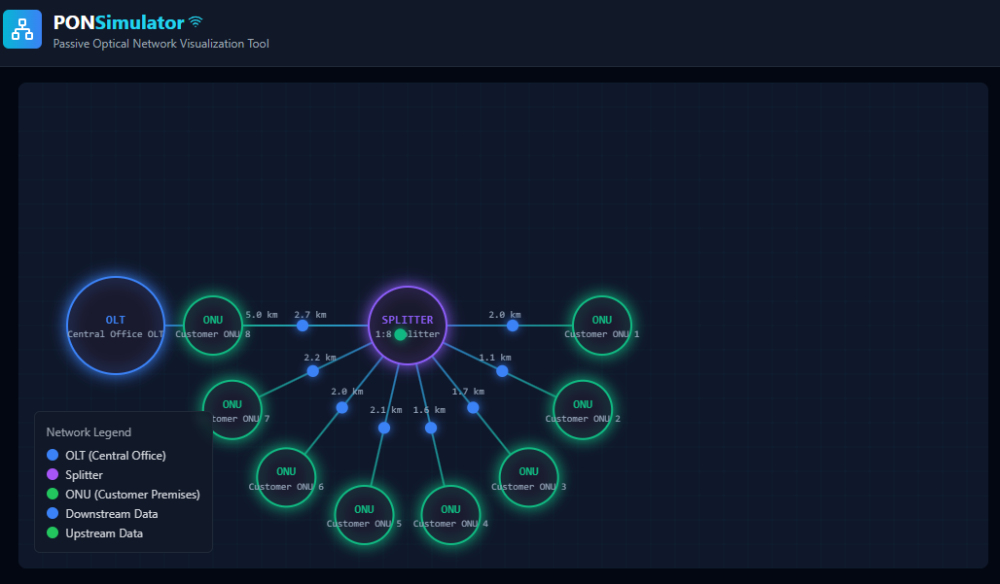
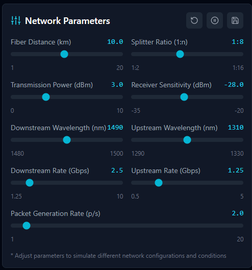
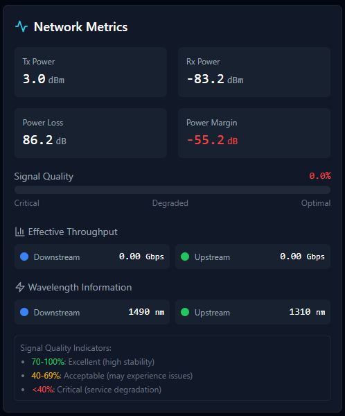

# PON Network Simulator


An interactive visualization tool for Passive Optical Network (PON) simulation with educational focus. This web-based application provides a real-time, visual representation of PON network topology and data transmission.

## Features

- **Interactive Network Diagram**: Visual representation of PON topology including OLT, splitter, and ONUs
- **Real-time Data Flow**: Animated visualization of upstream and downstream data packets
- **Configurable Parameters**: Adjustable network parameters including:
  - Fiber distance
  - Splitter ratio
  - Transmission power
  - Receiver sensitivity
  - Wavelength settings
  - Data rates
- **Live Metrics**: Real-time monitoring of:
  - Signal quality
  - Power levels
  - Throughput rates
  - Optical budget calculations

## Technology Stack

- React 18
- TypeScript
- Tailwind CSS
- Vite
- Lucide Icons

## Getting Started

### Prerequisites

- Node.js (v18 or higher)
- npm or yarn

### Installation

1. Clone the repository:
```bash
git clone https://github.com/yourusername/pon-simulator.git
cd pon-simulator
```

2. Install dependencies:
```bash
npm install
```

3. Start the development server:
```bash
npm run dev
```

4. Open your browser and navigate to `http://localhost:5173`

## Usage

### Network Diagram

The network diagram shows a typical PON topology with:
- OLT (Optical Line Terminal) at the central office
- Passive splitter for signal distribution
- Multiple ONUs (Optical Network Units) at end-user locations

### Parameter Controls

Adjust network parameters using the control panel:

- **Fiber Distance**: Set the length of fiber optic cables (1-20 km)
- **Splitter Ratio**: Configure the splitting ratio (1:2 to 1:16)
- **Transmission Power**: Adjust optical power levels (0-10 dBm)
- **Receiver Sensitivity**: Set receiver threshold (-35 to -20 dBm)
- **Wavelengths**: Configure upstream and downstream wavelengths
- **Data Rates**: Set transmission speeds for both directions

### Metrics Panel

Monitor network performance through:
- Signal quality indicators
- Power budget calculations
- Real-time throughput measurements
- Wavelength information

## Technical Details

### PON Technologies Supported

| Technology | Downstream | Upstream | Wavelength |
|------------|------------|----------|------------|
| GPON       | 2.5 Gbps   | 1.25 Gbps | 1490/1310 nm |
| EPON       | 1.25 Gbps  | 1.25 Gbps | 1490/1310 nm |
| XG-PON     | 10 Gbps    | 2.5 Gbps  | 1577/1270 nm |
| XGS-PON    | 10 Gbps    | 10 Gbps   | 1577/1270 nm |

### Power Budget Calculations

The simulator considers various factors in power budget calculations:
- Fiber attenuation (typical 0.35 dB/km)
- Splitter insertion loss
- Connector losses
- Receiver sensitivity
- Power margin requirements

## Contributing

Contributions are welcome! Please feel free to submit a Pull Request.

### Development Guidelines

1. Fork the repository
2. Create your feature branch (`git checkout -b feature/AmazingFeature`)
3. Commit your changes (`git commit -m 'Add some AmazingFeature'`)
4. Push to the branch (`git push origin feature/AmazingFeature`)
5. Open a Pull Request

## License

This project is licensed under the MIT License - see the [LICENSE](LICENSE) file for details.

## Acknowledgments

- Built with React and TypeScript
- Styled with Tailwind CSS
- Icons from Lucide React
## Screenshots

### Main Dashboard

*Displays the main dashboard with the PON network topology, visually representing elements such as OLT, splitter, and ONUs, along with real-time network performance metrics.*

### Network Parameters

*Shows the configuration interface for network parameters, allowing you to adjust fiber distance, splitter ratio, transmission power, receiver sensitivity, wavelengths, and data rates.*

### Network Metrics

*Presents the metrics panel, where you can monitor signal quality indicators, power budget calculations, real-time throughput, and information about the wavelengths in use.*

## Contact

Alessandro Augusto - [@GitHub](https://github.com/alessandro0augusto0)

Project Link: [https://github.com/alessandro0augusto0/pon-simulator](https://github.com/alessandro0augusto0/pon-simulator)